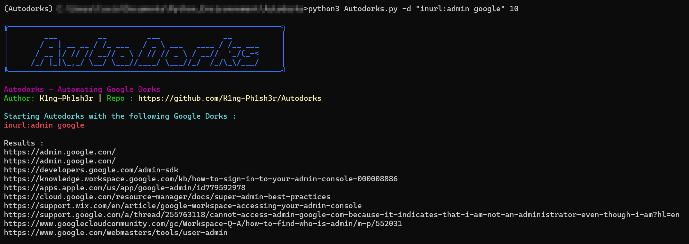

# Autodorks
A simple python script that simplifies the use of Google Dorks

## Description
This small script is based on RobotShell's [DorkScraper](https://github.com/robotshell/dorkScraper) project. I improved the code and added some features that I needed to have. 



### What it does 
This python script allows the user to :
- Execute custom google dorks
- Execute specific google dorks already in the script (see [argument segment](https://github.com/K1ng-Ph1sh3r/Autodorks/edit/main/README.md#list-of-all-of-the-arguments))
- Return results in a given file
- Define a specific number of results wanted (for instance, returning the first 10 results of a google dorks)

### Dependancies 

This script relies only on [*Googlesearch-python*](https://pypi.org/project/googlesearch-python/), which will allow the script to execute some google searches.

### List of all of the arguments 

| Argument        | What it does                 | 
| --------------- | ---------------------------- |
| -w or --website | Specify the domain name of the website that you want to use the google dorks on|
| -d or --dork    | Specify the google dork wanted |
| -v or --version | Shows version                                    |
| -h or --help    | Diplays help about Autodorks                     |
| -l or --list    | Displays the list of all configured google dorks |

## Usage
Here are some example of how to use Autodorks :

**Example 1 :** Displaying the help for Autodorks :
```
python3 autodorks.py -h
```
Will return the list of all available commands for Autodorks.

**Example 2 :** Executing a custom Google dorks :
```
python3 autodorks.py -d "inurl:admin google" 5
```
Will return the first five results of the google dorks "inurl:admin google"

**Example 1 :** Executing a configured Google dorks
```
python3 autodorks.py FTPG-01 -w "google.com" 10
```
Will return the first ten results of the configured Google dork FTPG-01 : "inurl:ftp -inurl:http -inurl:https inurl:[Website]"

## Installation
I recommend using this script in a dedicated python environment, but it is not mandatory.

### Cloning the repo 
```
git clone https://github.com/K1ng-Ph1sh3r/Autodorks.git
cd Autodorks
chmod +x autodorks.py
```
### Installing dependancies
```
pip install -r REQUIREMENTS.txt
```

### Trying to run the script
```
python3 autodorks.py -v
```
If it returns the version, you can now use Autorks :D

## Disclaimer
- This script is made for educational purpose only, I am not responsible for any misuse of this tool.

- Code may not be perfect, and was never meant to be. So be aware, some errors can happen.
